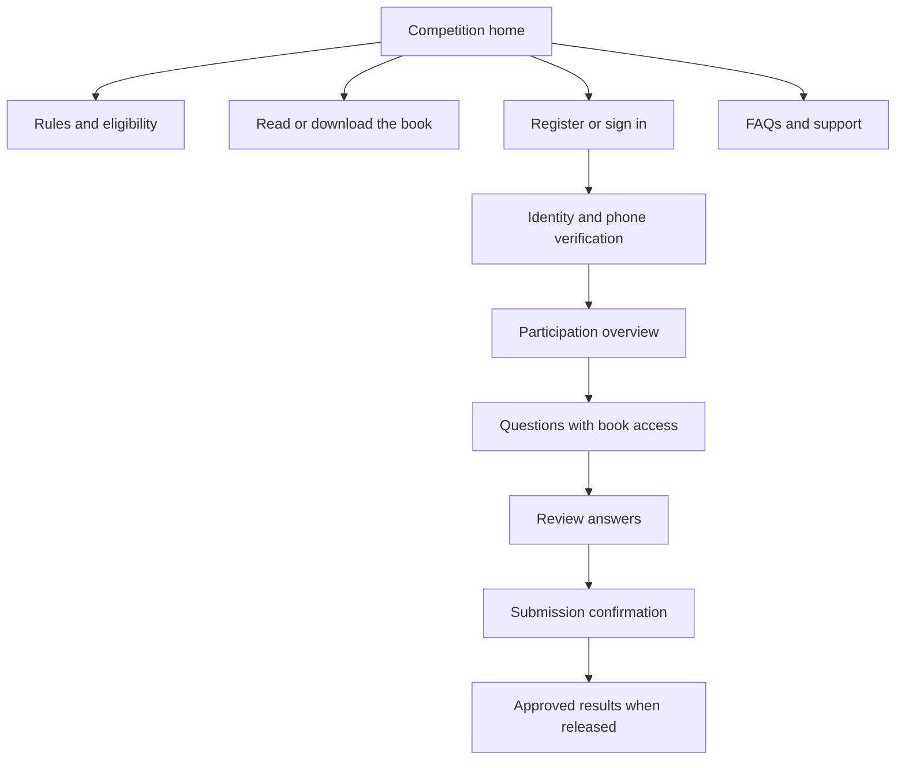

# Arabic design and participant experience

Parent: [[00-NBC-Research-Index]]

> [!abstract] Recommended design hypothesis
> Explore a **book-led, contemporary institutional design**: strong Arabic typography, generous reading space, restrained cultural accents and an obvious path to participation. Use the organizer’s approved branding and determine the applicable كود المنصات requirements before finalizing the visual system.

## Evidence and limits of the design research

DGA describes **كود المنصات** as the national design-system reference for consistent government interfaces. The official overview was available through indexed evidence; detailed live component pages were not successfully inspected. [DGA overview](https://dga.gov.sa/ar/digital-knowledge/national-design-system-of-Saudi-Arabia).

The SAIP service-detail page offers a useful information structure: service description, intended audience, requirements, steps, FAQs and an application action. The Ministry of Culture competition portal exposes competition sections, tracks, conditions and winner archives. These were examined as page-content structures, not fully audited interactive experiences. [SAIP service example](https://saip.gov.sa/en/services/designs/application), [cultural competition portal](https://engage.moc.gov.sa/cst/).

The supplied PDF was visually inspected. A browser attempt to inspect the cultural portal timed out; no live-site screenshot review is claimed. The proposals below are design hypotheses, not conclusions from interviews or conversion experiments.

## Three candidate art directions

| Candidate | Visual approach | Strength | Risk | Recommendation |
|---|---|---|---|---|
| A. Institutional reading room | Approved institutional colors, light reading surfaces, confident Arabic headings, a restrained book motif | Fits the brief and keeps assessment readable | Can feel generic without careful typography and layout | **Preferred baseline to explore.** |
| B. Threads of belonging | Original interwoven lines framing campaign content, with neutral form/question surfaces | Gives cohesion a visual expression | Pattern density or cultural overclaiming | Compare against A in concept testing. |
| C. Youth cultural exhibition | Large editorial imagery, expressive section openings, minimal motion | Potentially memorable campaign page | Can distract from rules or slow mobile use | Optional campaign layer, not the default quiz interface. |

Do not lock arbitrary hex colors or a font license into the bid before receiving the brand kit and checking DGA expectations. For concept comparison, test the same content and journey across A and B so visual preference is not confused with easier wording.

## Proposed information architecture

This diagram is a proposed flow. Verification policy, resumability, final review rules and result-release timing need organizer agreement. Registration, starting an attempt and final submission must be visibly distinct.

## Screen-by-screen direction

| Screen | Primary task | Essential content or state | Proposal detail worth showing |
|---|---|---|---|
| Home | Understand the competition | Book title, audience, concise mechanics, official dates once supplied, rules/help | Book access and eligibility before requesting personal data |
| Registration | Provide required information | ID/iqama, full name, primary mobile, optional backup, stage, geography, terms | Clear optional labels and explanation of requested fields |
| OTP | Verify phone access | Masked destination, paste support, resend state, help | Expired/delayed-code recovery without losing registration |
| Participation overview | Understand next action | Current attempt state, book link, approved instructions | Clear distinction between saved draft and final submission |
| Question | Answer and consult source | Readable prompt, selectable answers, progress, previous/next, book | Returning from the book preserves selections |
| Review | Check the attempt | Answered/unanswered summary; finality explained | No hidden auto-submission |
| Receipt | Know submission succeeded | Non-sensitive reference, date/time, next step | “Submitted” without premature winner or answer disclosure |
| Results | See approved information | Only authorized score/outcome and public winner data | No answer-key exposure or full-ID publication |
| Administration | Operate the campaign | Counts, exceptions, bank versions, approvals, reporting | Tied cases, notification state and export permissions |

The PDF requires one participation per person, not one browser session. We recommend saved progress and recovery, but confirm the exact resume model before promising it. Security session expiry should require reauthentication without silently becoming a quiz timer.

## Arabic interaction details

W3C’s Arabic layout note explains that Arabic text and numbers have different directional behavior, especially with punctuation and mixed strings. It is a Group Draft Note, not a conformance certificate. [W3C Arabic and Persian layout requirements](https://www.w3.org/TR/alreq/).

Proposed checks:

- Arabic labels and text align naturally; identifiers and phone numbers maintain their intended order.
- Accept appropriate Arabic and Western digit entry without changing the identifier’s meaning.
- Keep field labels visible after typing, and explain errors next to the relevant field.
- Test long names and locality names without clipping or arbitrary truncation.
- Do not reverse media controls or every icon simply because the interface is RTL.
- Keep answer choices large enough to select comfortably; use text plus a visible selection state.
- Avoid placing patterned or photographic backgrounds behind dense reading or questions.

## Accessibility acceptance target

Recommend **WCAG 2.2 AA** as a stated project target, subject to the governing requirements. WCAG covers keyboard operation, contrast, focus, error identification, redundant entry and accessible authentication. Relevant criteria include 2.1.1, 2.4.7, 2.4.11, 3.3.1, 3.3.7 and 3.3.8. [W3C WCAG 2.2, 12 December 2024 edition](https://www.w3.org/TR/2024/REC-WCAG22-20241212/).

The future review should cover the complete journey, including the source book, OTP and error states. Test keyboard navigation, a screen reader, zoom/reflow, contrast, visible focus and non-color status cues. Support paste/autofill for codes. A successful automated scan alone is insufficient evidence of conformance.

DGA’s accessibility guide V2.0 was consulted through indexed official passages, with full retrieval unavailable. Its applicability should be confirmed with the customer rather than claiming every accessibility level is automatically mandatory. [DGA accessibility guide](https://dga.gov.sa/sites/default/files/2024-05/Guideline%20For%20Web%20Accessibility%20of%20Digital%20Channels%20Content%20to%20Serve%20People%20with%20Disabilities%20and%20the%20Elderly-V2.0_0.pdf).

## Candidate Arabic microcopy

| Moment | Proposed copy |
|---|---|
| Backup phone | رقم جوال احتياطي — اختياري |
| Code sent | أرسلنا رمز التحقق إلى رقم جوالك المسجّل. |
| Code expired | انتهت صلاحية الرمز. اطلب رمزًا جديدًا للمتابعة. |
| Save success | تم حفظ إجابتك. |
| Save failure | لم نتمكن من حفظ إجابتك. تحقق من الاتصال ثم أعد المحاولة. |
| Return to book | الرجوع إلى الكتاب |
| Final review | راجع إجاباتك قبل الإرسال النهائي. |
| Submission success | تم استلام مشاركتك بنجاح. |
| Results pending | ستُعلن النتائج بعد اعتمادها من الجهة المنظمة. |

Show save-success text only after an actual save succeeds. Copy about finality and publication remains subject to committee approval.

## Design evaluation before development

Recruit an initial qualitative sample spanning the required stages, both genders and school types; include participants using assistive technology and weaker connections where feasible. This is a proposed research sample, not completed research. Ask users to find the rules, identify whether book use is permitted, recover from an OTP error, revisit an answer, and explain whether their attempt is saved or submitted.

Record task completion, confusion, assistance needed and observed failure points. Do not ask only “Do you like the design?” Choose the concept that best supports the journey and the actual evaluation rubric.

Related: [[04-Cultural-Context-and-Editorial-Direction]], [[08-Proposal-and-Winning-Strategy]], [[10-Discovery-Roadmap-and-Success-Metrics]].

