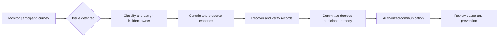

# Privacy, security and operating readiness

Parent: [[00-NBC-Research-Index]]

> [!abstract] Bid position
> Make protection and reliability concrete: identify who controls the data, demonstrate what each role can access, preserve submissions, and show how the service recovers. Scope the applicable controls with the customer before making compliance or availability commitments.

## Legal and standards baseline

Saudi Arabia’s PDPL defines names, identity numbers and contact details as personal data. Its scope includes processing in the Kingdom and overseas processing of residents’ data. It addresses purpose-limited collection, notices, rights, retention and controller responsibility when outsourcing. Article 28 restricts copying identity documents to specified circumstances; an ID-image upload should not be added by default. [SDAIA PDPL, Arts. 1–2, 8, 11–13, 18 and 28](https://dgp.sdaia.gov.sa/wps/portal/pdp/knowledgecenter/details/PDPL/).

The Implementing Regulation addresses consent capacity and verifying guardianship where guardian consent is used. It excludes public controllers from its legitimate-interest route and sets triggers for impact assessments and data-protection officers. Article 24 requires authority notification within **72 hours of awareness** when the specified harm/rights threshold is met. These provisions do not establish a universal child-consent age from educational stage. [SDAIA Implementing Regulation, Arts. 11–13, 16, 24–25 and 32](https://dgp.sdaia.gov.sa/wps/portal/pdp/knowledgecenter/details/PDPL2/).

NCA ECC 2:2024 applies to government agencies and their affiliates, and private entities owning, operating or hosting critical national infrastructure; individual controls have applicability conditions. For an authority-owned production service, establish a control-responsibility matrix with the authority. A private mockup is not automatically subject to every ECC control simply because the intended client is governmental. [NCA ECC 2:2024, scope p. 9](https://cdn.nca.gov.sa/api/files/public/upload/86e09090-44e4-481f-bc28-355673607654_ECC--2024-EN.pdf).

This is a scoped research baseline, not a legal opinion, audit or certification. The production data flow, contracting entity, hosting and integrations are still unknown.

## Decisions required before real participant data

Assign a named owner for each of these decisions:

| Decision | Proposed owner to confirm | Concrete output |
|---|---|---|
| Processing purposes and lawful basis | Organizer’s privacy/legal owner | Approved purpose-and-basis record |
| Controller, processor and subprocessors | Contracting authority and delivery lead | Responsibility and supplier schedule |
| Capacity and guardian pathway | Privacy/legal and education stakeholders | Approved verification and consent journey |
| Hosting, backups and support access | Authority security/IT | Approved locations, providers and access model |
| Collection and retention | Data owner | Field inventory and retention/deletion schedule |
| Winner publication | Committee and privacy owner | Approved fields, audience and release process |
| Incident notification | Incident lead and privacy owner | Decision and notification runbook |
| Impact assessment and DPO applicability | Privacy owner | Documented assessment against regulatory triggers |

Do not assume that accepting competition terms settles every privacy purpose. Separate necessary competition processing from optional publicity or unrelated marketing. Do not infer that all data transfers are prohibited or allowed: evaluate the actual hosting, SMS, analytics, support and backup routes under applicable requirements before selecting suppliers.

## Field-level design recommendations

These are proposed product controls, not extra fields required by the PDF.

| Data | Why the brief needs it | Proposed handling |
|---|---|---|
| National ID / iqama | Eligibility and unique participation | Mask in routine screens; limit full-value access; exclude from URLs and general logs |
| Full name | Participant administration | Do not publish by default; test long Arabic names |
| Primary mobile | OTP and communication | Display masked destination; controlled change/recovery |
| Backup mobile | Optional contact | Optional in form and storage; clarify ownership and permitted use |
| Educational stage | Eligibility and reports | Record approved categories, not inferred age or ability |
| Geography | Required locality reports | Controlled locality model; no GPS or street address unless separately justified |
| Answers and scores | Assessment and results | Restrict answer-key access; separate provisional from approved results |
| Operational logs | Reliability and audit | Use non-sensitive references; define access and retention |
| Guardian evidence, if required | Approved capacity/consent process | Collect only what the approved process needs, with restricted access |

A score concerns answers to the book-based questions. Do not create profiles of religious or political belief from answers or use the data to label students’ loyalty.

## OTP is not complete identity verification

NIST distinguishes authentication through control of an authenticator from identity proofing. Its current guidance treats SMS/PSTN authentication as restricted and discusses risks including SIM changes. It also recognizes shared family devices. This is a technical reference, not Saudi law or an instruction to replace the brief’s OTP requirement. [NIST SP 800-63B, fourth-revision site](https://pages.nist.gov/800-63-4/sp800-63b.html).

**Our implication:** an entered ID plus a code delivered to a phone does not independently prove that the ID belongs to the entrant, that the entrant is enrolled at an eligible institution, or that a phone holder is a legal guardian. Ask for the authorized assurance and verification route. Do not promise a government integration, associated access or cost before it is approved and available.

Proposed OTP controls include expiration, one-time use, resend/guess limits, generic messages that do not expose account existence, safe recovery, and staff access that never requires asking for a participant’s code. Enforce one entry per person under the approved identity model; avoid treating one shared phone or school IP as proof of duplicate participation.

## Threat and failure model

| Scenario | Consequence | Proposed control | Demonstration |
|---|---|---|---|
| Duplicate final submissions | Multiple entries or inconsistent state | One finalization operation per attempt; retries return the same outcome | Double-click and retry after a lost response |
| Refresh or device change | Lost answers or redrawn questions | Saved attempt identity and stable assigned form | Reauthenticate and recover the same state |
| Correct keys sent with questions | Answer-bank exposure | Keep keys outside participant data responses | Inspect all participant-accessible responses |
| Overprivileged export | Exposure of identities and scores | Role-specific exports with access history | Low-privilege operator receives only approved columns |
| Unreviewed bank change | Inconsistent grading | Version control and committee correction process | Show audit trail and affected population |
| OTP/SMS outage | Registration blocked | Delivery monitoring, bounded retries and support escalation | Simulate delayed or failed delivery |
| Reminder race | Messages sent after completion | Recheck status before send; deduplicate queued messages | Complete an attempt before queued reminder dispatch |
| Deadline incident | Unfair loss of opportunity | Published closing/extension policy and incident authority | Rehearse outage near closing |
| Backup unavailable or unusable | Permanent loss of records | Isolated backup and tested restoration | Recover a known synthetic dataset |

## Proposed operating model

Use separate roles for participant support, question author/reviewer, competition administrator, result approver and technical operator. Staff should see the minimum data needed for their work. Require stronger authentication for privileged access and log sensitive administrative actions. These controls support the brief’s privacy and transparency objectives; their exact implementation is not selected here.

Keep campaign messaging separate from operational health. A server response alone is not a complete availability check: registration, OTP, answer saving and final submission each need monitoring.

## Service levels and capacity: establish, then promise

The PDF requires backups, scalability and support, but gives no traffic forecast, availability percentage, response-time guarantee, recovery target or support hours. [[Source-Committee-PDF]], p. 4.

Ask for expected registrations, active entrants near closing, campaign duration, SMS allowance, book size, export needs and support coverage. Agree a representative load profile before measuring performance. Define recovery point objective as acceptable data loss and recovery time objective as acceptable restoration time, then choose a design that can meet them.

Quote recurring costs separately: hosting, database, storage, book delivery, backup, monitoring, SMS, identity services, support and independent testing. Avoid an unsupported fixed operating price or “unlimited users” claim.

## Data handover and campaign closure

The contract should specify ownership of source code, designs, approved content and operational data; accessible export formats; deployment documentation; staff training; administrative access handover; retention and deletion; and maintenance responsibility. Rehearse export and restoration using synthetic data before participant data is collected.

Related: [[06-Assessment-Fairness-and-Content]], [[08-Proposal-and-Winning-Strategy]], [[11-Open-Questions-and-Evidence-Gaps]].

