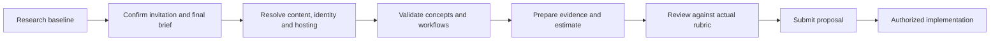

# Discovery roadmap and success measures

Parent: [[00-NBC-Research-Index]]

> [!abstract] Next step
> Use a short, decision-focused discovery phase to obtain the missing competition pack, validate the experience, and make the proposal demonstrable. The sequence below is a recommendation, not a contracted schedule.

## Readiness gates

Research is complete to the limits of available evidence. Organizer-supplied decisions remain open; completing research does not mean the project is ready for production.

## Proposed discovery work packages

| Package | Activities | Output | Exit condition |
|---|---|---|---|
| 1. Opportunity verification | Read invitation, final requirements, evaluation rules and submission format | Bid brief and clarification register | Procuring entity, deadline and evaluation method understood |
| 2. Competition governance | Clarify eligibility, questions, scores, ties, corrections and release | Approved rule model and responsibility map | No unresolved rule changes hidden in the proposed experience |
| 3. Content readiness | Obtain approved book, rights, errata and question ownership | Versioned content inventory | Source file and production responsibilities agreed |
| 4. Service discovery | Interview staff and representative users; map failure states | Journey map and concept findings | Major usability assumptions tested |
| 5. Operating model | Confirm hosting, integrations, privacy, traffic and support | Dependencies, control responsibilities and service targets | Delivery constraints and cost drivers known |
| 6. Proposal evidence | Prepare a limited demonstrator and required submission material | Evidence pack and estimate | Claims supported and any simulations labeled |
| 7. Final review | Score against actual rubric; check requirements and pricing | Submission-ready package | Required format, signatures and acceptance conditions satisfied |

Packages can overlap when inputs allow. Do not assign calendar dates until the actual deadline, team capacity and approval turnaround are known.

## Stakeholder interviews

**Competition sponsor:** What would make the campaign successful? Who accepts the platform? Which requirements are final? Which document controls if instructions conflict?

**Scientific committee:** Who supplies and approves questions? What does random distribution mean? Are stages scored together? How are invalid items, ties and appeals resolved?

**Operations staff:** Which tasks happen daily? What causes support demand? Which reports must be signed or exported? Who approves reminders and publication?

**IT/security/privacy:** What platforms, identity services and environments are available? Who owns the records? Which controls and hosting arrangements apply? What integration access exists?

**Students:** Can they explain the rules, find the book, complete registration, recover from an error and distinguish saved from submitted? Use representatives from the specified population; do not infer answers from staff alone.

No interviews or usability sessions have been performed in this research task.

## Proposed success measures

These are definitions to agree, not observed results or guaranteed targets.

| Measure | Definition | Important interpretation |
|---|---|---|
| Registration completion | Completed verified registrations / started registration flows in the same cohort | Exclude test accounts and define abandoned-flow tracking |
| OTP verification success | Successful verifications / eligible verification challenges | Distinguish provider delivery from user completion |
| Participation completion | Final submitted attempts / eligible registered participants at a defined cutoff | Also report submitted / started attempts; these answer different questions |
| Save reliability | Successfully acknowledged saves / attempted saves | Acknowledged saves must survive recovery |
| Submission consistency | Finalization retries returning one consistent receipt and final record | Inspect integrity failures, not just average latency |
| Accessibility quality | Verified criteria and critical journeys passed, with open defects | Not a percentage inferred from one automated scanner |
| Support demand | Relevant support cases / active participants | Volume alone can fall because help is hard to find |
| Report consistency | Reconciliation differences across reports using the same filters and timestamp | Target zero unexplained differences |
| Result integrity | Scores reproduced from approved snapshot; resolved exceptions and ties | No manual unexplained changes |
| Book engagement | Privacy-approved aggregate use of book access features | Opening a book is not proof of reading or learning |
| User understanding | Participants correctly explain the next step and submission status | Measure through observation, not visual preference alone |
| Recovery readiness | Demonstrated restoration against agreed recovery targets | Test with known data and document what was recovered |

Report counts with an as-of time, population definition and excluded states. Do not publish tiny locality segments or infer cultural attitudes from activity. Broader claims about learning require a separate, valid evaluation design; competition scores alone do not establish improvement.

## Proposed acceptance scenarios

| Area | Scenario | Expected outcome |
|---|---|---|
| Eligibility | Eligible iqama entrant at an included institution | Correct approved path, with no accidental citizens-only restriction |
| Registration | Long Arabic name and optional backup left blank | No truncation or false mandatory field |
| OTP | Expired code, then new code | Clear recovery with preserved data and controlled retries |
| Identity uniqueness | Two finalization requests for one person | One participation under the approved identity model |
| Book access | Open/download during an attempt | Book accessible; attempt state preserved |
| Navigation | Change a previous answer before finalization | Authorized change saved correctly |
| Session expiry | Reauthentication during an unfinished attempt | Approved recovery behavior; no hidden answer timer |
| Randomization | Resume an assigned attempt | Same assigned question and option identities |
| Scoring | Known synthetic answer sets | Exact expected score under the approved policy |
| Ties | Equal scores with different elapsed times | No time effect on placement |
| Confidentiality | Inspect participant-visible result and data responses | No correct-answer key or other participant’s records |
| Reports | Filter the same cohort by stage and locality | Counts reconcile under documented definitions |
| Notifications | Participant completes before reminder dispatch | Reminder canceled or suppressed as approved |
| Operations | Restore a known backup | Verified records within agreed recovery limits |
| Publication | Unapproved provisional results exist | No public winner release or congratulations yet |

The baseline expectations come from [[Source-Committee-PDF]]; failure-recovery and governance details are our proposed verification approach. These tests are not yet implemented or executed.

## Build-readiness checklist

- [ ] Invitation, evaluation criteria, deadline and required format obtained.
- [ ] Final requirements version and change authority confirmed.
- [ ] Approved book, rights and question responsibilities confirmed.
- [ ] Identity, education and capacity/guardian verification routes agreed.
- [ ] Questions, scoring, form assignment and tie policies approved.
- [ ] Campaign closing, resume, appeals and correction rules approved.
- [ ] Data roles, hosting, suppliers and relevant controls scoped.
- [ ] Arabic journey and visual concept evaluated.
- [ ] Traffic assumptions, support coverage and operating costs agreed.
- [ ] Acceptance, handover, ownership and maintenance recorded.

Related: [[08-Proposal-and-Winning-Strategy]], [[11-Open-Questions-and-Evidence-Gaps]].

